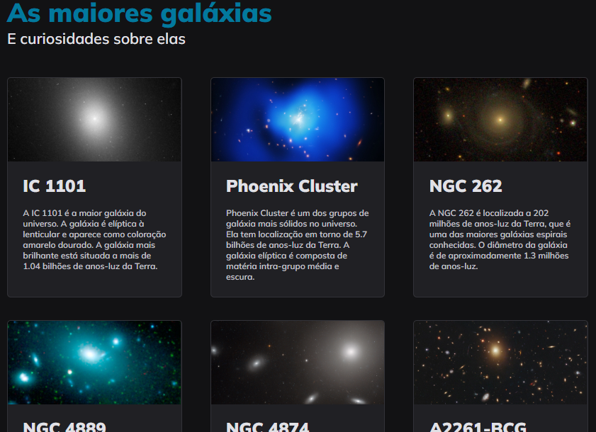

<h1 align="center"> Projeto Galaxies </h1>

Aquecendo o GRID CSS 

  

 

  

## 🚀 Tecnologias

Esse projeto foi desenvolvido com as seguintes tecnologias:

- HTML e CSS
- Figma

## 💻 Projeto

O Projeto Galaxies foi desenvolvido durante o Stage 3, Explorer, da RocketSeat.

